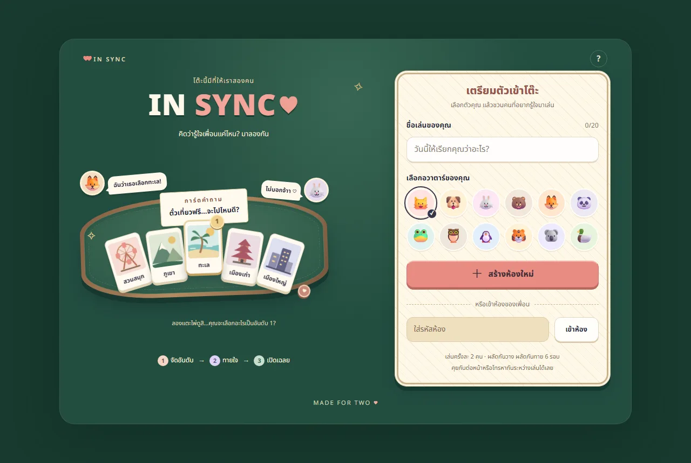
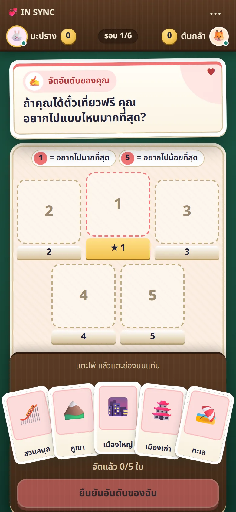
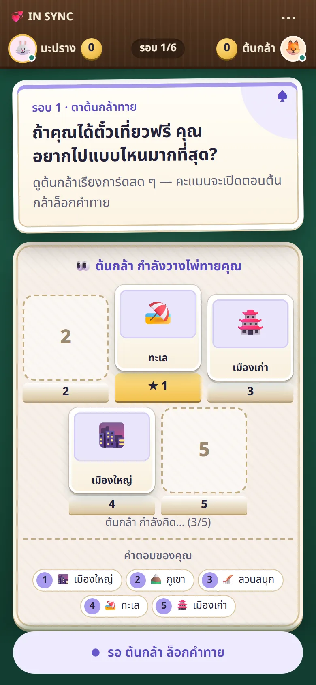
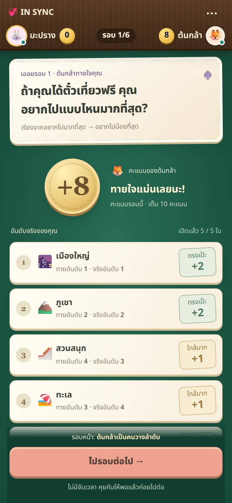
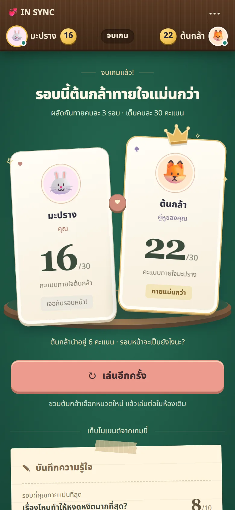

<div align="center">

# 💞 IN SYNC

**เกมจัดอันดับสำหรับสองคน — เรียงของที่ชอบ ทายใจอีกคน แล้วเปิดเฉลยพร้อมกัน**

คิดว่ารู้ใจเพื่อนแค่ไหน? มาลองกัน

[](https://heartsyncboardgamebymingmx.vercel.app)


<br />



</div>

<br />

## 🃏 เกมนี้เล่นยังไง

หนึ่งเกมมี **6 รอบ** แต่ละรอบสลับกันเป็นคนวางกับคนทาย

| | ขั้นตอน | เกิดอะไรขึ้น |
| :---: | --- | --- |
| **1** | 🙋 **คนวางจัดอันดับ** | เรียงไพ่ 5 ใบตามใจตัวเองลงแท่นอันดับ อีกฝ่ายเห็นแค่คำถามระหว่างรอ |
| **2** | 🤔 **คนทายทายใจ** | เรียงตามที่คิดว่าอีกฝ่ายเรียงไว้ คนวางเห็นไพ่ขยับแบบสด ๆ แต่ยังไม่เห็นคะแนน |
| **3** | ✨ **เปิดเฉลย** | พลิกไพ่ทีละใบ ตรงเป๊ะได้ **+2** ห่างหนึ่งอันดับได้ **+1** |

จบเกม แต่ละคนได้ทาย 3 รอบ เต็มคนละ 30 คะแนน แล้วดูว่าใครรู้ใจอีกฝ่ายมากกว่ากัน 👑

<table>
  <tr>
    <td align="center" width="25%"></td>
    <td align="center" width="25%"></td>
    <td align="center" width="25%"></td>
    <td align="center" width="25%"></td>
  </tr>
  <tr>
    <td align="center"><sub><b>จัดอันดับ</b><br />แตะไพ่ แล้วแตะช่อง</sub></td>
    <td align="center"><sub><b>ดูอีกฝ่ายทายสด ๆ</b><br />เห็นทุกการขยับ</sub></td>
    <td align="center"><sub><b>เปิดเฉลย</b><br />พลิกทีละใบ</sub></td>
    <td align="center"><sub><b>สรุปคะแนน</b><br />ใครรู้ใจกว่ากัน</sub></td>
  </tr>
</table>

## ✨ จุดเด่น

- 👥 **เล่นสองคนจริง ๆ** คนละเครื่องหรือคนละเบราว์เซอร์ ผ่านห้องที่มีรหัส 6 ตัว ไม่ต้องสมัครสมาชิก
- 🔒 **คำตอบเป็นความลับจนถึงเวลาเฉลย** บังคับที่ชั้นฐานข้อมูล ไม่ใช่แค่ซ่อนไว้ในหน้าจอ
- 🔄 **กลับเข้าเกมเดิมได้** รีเฟรช ปิดแท็บ หรือเน็ตหลุดแล้วกลับมานั่งที่เดิม และหนึ่งคนอยู่ได้ครั้งละห้องเดียว แม้กดจากหลายแท็บพร้อมกัน
- 🎲 **ธีมโต๊ะบอร์ดเกม** ไพ่ แท่นอันดับ ถาดไม้ และใบโน้ตกระดาษ ออกแบบมาเพื่อจอมือถือก่อน และจัดเป็นสองคอลัมน์บนจอคอมพิวเตอร์
- 🇹🇭 **UI ภาษาไทยทั้งหมด** วางไพ่ได้ทั้งลาก และแตะไพ่แล้วแตะช่อง

## 🛠️ สร้างด้วย

| ส่วน | ที่ใช้ |
| --- | --- |
| หน้าเว็บและ API | Next.js 16 (App Router) · React 19 · TypeScript |
| Realtime และฐานข้อมูล | Firebase Realtime Database |
| ตัวตนผู้เล่น | Firebase Anonymous Auth — ไม่ต้องสมัคร |
| หน้าตา | CSS Modules · ฟอนต์ Noto Sans Thai |
| ทดสอบ | Vitest — unit และ integration กับ Firebase emulator |
| Deploy | Vercel |

> [!NOTE]
> กติกาทั้งหมดเป็น pure function ที่ทำงานใน transaction เดียวของฐานข้อมูล ผู้เล่นแต่ละคนอ่านได้เฉพาะมุมมองของตัวเองที่ server สร้างให้ คำตอบของอีกฝ่ายจึงไม่หลุดมาถึงเครื่องก่อนเฉลย

## 🚀 รันในเครื่อง

ไม่ต้องมีบัญชี Firebase — ใช้ emulator ได้เลย (ต้องมี Node.js 24 และ Java 21 ขึ้นไป)

```powershell
npm ci

# หน้าต่างที่ 1 — Firebase emulator
npm run emulators

# หน้าต่างที่ 2 — เว็บ
npm run dev:emulator
```

เปิด <http://localhost:3000> แล้วเปิดอีกหน้าต่างแบบ incognito เพื่อเล่นเป็นผู้เล่นคนที่สอง

> [!TIP]
> วิธีต่อ Firebase project จริง คำสั่งทั้งหมด การทดสอบ และการ deploy อยู่ใน **[คู่มือนักพัฒนา](docs/DEVELOPMENT.md)**

<details>
<summary><b>📁 โครงสร้างโปรเจกต์</b></summary>

<br />

```text
src/app/          หน้าเว็บและ API routes
src/features/     หน้าแรก และหน้าต่าง ๆ ในห้องเกม
src/components/   การ์ด อวาตาร์ ปุ่ม และฟอร์มที่ใช้ร่วมกัน
src/lib/game/     กติกาและคะแนน (ไม่ผูกกับ Firebase)
src/lib/server/   ฝั่ง server: auth, transaction ของห้อง
src/lib/client/   ฝั่ง client: realtime, ร่างที่บันทึกไว้
tests/            unit tests และ integration tests
```

</details>

---

<div align="center">
<sub>MADE FOR TWO ♥ · ฟอนต์ Noto Sans Thai ใช้ตาม SIL OFL 1.1 (<a href="licenses/NotoSansThai-OFL.txt">license</a>)</sub>
</div>
